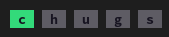
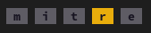

<p align="center">
    
</p>
<p align="center">
  <a href="https://github.com/lamemakes/rustle/actions/workflows/ci.yml">
    
  </a>
</p>
<p align="center">An open source Wordle CLI built in Rust</p>

## What is Rustle?
 
Rustle allows you to play the daily Wordle ad-free and from the comfort of your favorite Command Line Interface (CLI) - Unix or Windows!

Don't have a network connection or want to do some random Wordles? No worries - Rustle gives you the option to play a randomly generated Wordle based on an existing wordlist!

## Build & Install

The following tutorial shows you how to build Rustle:
```
git clone git@github.com:lamemakes/rustle.git   # Clone Rustle
cd rustle                                       # Enter the Rustle dir
cargo build                                     # Build the Rustle binary
```

To play using...
|                                 | Using the generated binary             | Using cargo             |
|---------------------------------|----------------------------------------|-------------------------|
|...the NYT's solution of the day | `.target/release/rustle`               | `cargo run`             |
|...a random "offline" solution   | `./target/release/rustle --offline`    | `cargo run -- --offline`|


## How to Play

- All guesses must be five letters long
- Your guess must be in the NYT's [list of valid words](https://raw.githubusercontent.com/lamemakes/rustle/master/src/assets/wordlist.json)
- The color of the tiles will change based on how close your guess was

### Examples


<br>**C** is in the word and is in the correct spot.


<br>**R** is in the word but in the wrong spot.


<br>None of these letters are in the word.

### Gameplay

